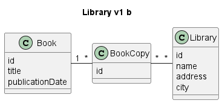
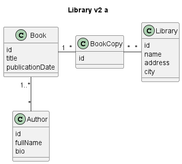
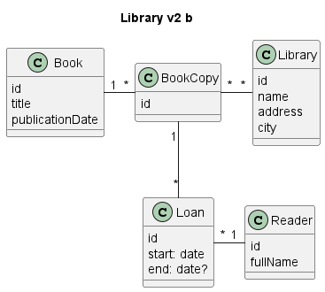
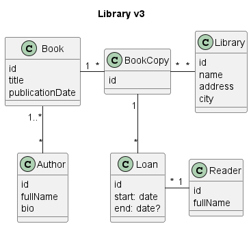

# Library Server

Example library management system where administrative users can register books with authors and add loans.

## Technology to be used

* Jetty 11
* Action Controller
* fluent-jdbc
* Flyway
* SLF4J with implementation Logevents

## Problem domain

* Books with authors
  * Multiple books
* Users
* Rentals where users rent books

### Simple model: Each book has one or more authors

### Simple model: Each book is in one or more libraries

### Books, authors and libraries

### Books, libraries and loans

### Books, authors, libraries and loans

